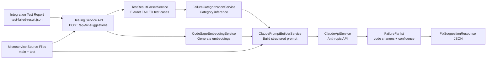

# Healing Service

AI-assisted Spring Boot microservice that analyzes failed integration tests, enriches context using CodeSage-style semantic ranking, and generates structured fix suggestions via Claude.

## What It Does

- Accepts failed test report JSON + microservice source context.
- Extracts failed test cases.
- Generates embeddings for provided source files.
- Selects semantically relevant files for each failure.
- Builds a structured prompt (`<role>`, `<task>`, `<instructions>`).
- Calls Claude API to return fix suggestions (TEST/SERVICE/BOTH) with confidence.

## Tech Stack

- Java 17
- Spring Boot 3.2.3
- Maven
- DJL (CodeBERT-compatible embedding flow)
- Anthropic Claude API

## Project Structure

```text
healingservice/
├─ pom.xml
├─ src/
│  ├─ main/
│  │  ├─ java/com/dissertation/fixsuggestion/
│  │  │  ├─ HealingServiceApplication.java
│  │  │  ├─ controller/
│  │  │  │  └─ FixSuggestionController.java
│  │  │  ├─ service/
│  │  │  │  ├─ TestResultParserService.java
│  │  │  │  ├─ FailureCategorizationService.java
│  │  │  │  ├─ CodeSageEmbeddingService.java
│  │  │  │  ├─ ClaudePromptBuilderService.java
│  │  │  │  └─ ClaudeApiService.java
│  │  │  ├─ model/
│  │  │  │  ├─ request/
│  │  │  │  │  ├─ FixSuggestionRequest.java
│  │  │  │  │  └─ SourceFile.java
│  │  │  │  ├─ response/
│  │  │  │  │  ├─ FixSuggestionResponse.java
│  │  │  │  │  ├─ FailureFix.java
│  │  │  │  │  └─ CodeChange.java
│  │  │  │  └─ internal/
│  │  │  │     ├─ TestResultReport.java
│  │  │  │     ├─ TestSuite.java
│  │  │  │     ├─ TestCase.java
│  │  │  │     ├─ TestFailure.java
│  │  │  │     └─ FailureCategory.java
│  │  │  ├─ config/
│  │  │  │  ├─ ClaudeApiConfig.java
│  │  │  │  └─ CodeSageConfig.java
│  │  │  └─ exception/
│  │  │     └─ GlobalExceptionHandler.java
│  │  └─ resources/
│  │     └─ application.yml
│  └─ test/
│     └─ java/com/dissertation/fixsuggestion/controller/
│        └─ FixSuggestionControllerTest.java
└─ target/
```

## Block Diagram



## Configuration

`src/main/resources/application.yml` (defaults):

- `server.port`: `8092`
- `claude.api.key`: from `CLAUDE_API_KEY` (or inline default)
- `claude.api.url`: `https://api.anthropic.com/v1/messages`
- `claude.api.model`: `claude-sonnet-4-20250514`
- `codesage.model.name`: `microsoft/codebert-base`
- `codesage.model.similarity-threshold`: `0.75`

## Run

```bash
cd /Users/pkb/cursor/dissertation/healingservice
mvn spring-boot:run
```

Service base URL: `http://localhost:8092`

## API

### 1) Health

```bash
curl -s http://localhost:8092/actuator/health | jq .
```

### 2) Generate Fix Suggestions

Use an existing request file:

```bash
curl -s -X POST "http://localhost:8092/api/fix-suggestions" \
  -H "Content-Type: application/json" \
  -d @/Users/pkb/cursor/dissertation/healingservice/test-request-single-contract.json | jq .
```

Or use integration test output (failed-only wrapper payload):

```bash
curl -s -X POST "http://localhost:8092/api/fix-suggestions" \
  -H "Content-Type: application/json" \
  -d @/Users/pkb/cursor/dissertation/integrationtestautomation/target/surefire-reports/test-failed-result.json | jq .
```

## Example Request Shape

```json
{
  "testResultJson": {
    "generatedAt": "...",
    "suites": [
      {
        "name": "TestSuite",
        "testCases": [
          {
            "name": "testUserRegistrationContract",
            "status": "FAILED",
            "failure": {
              "message": "...",
              "type": "java.lang.AssertionError",
              "stackTrace": "..."
            }
          }
        ]
      }
    ]
  },
  "microserviceContext": {
    "services": [
      {
        "serviceName": "user-service",
        "buildTool": "maven",
        "springBootVersion": "3.2.3",
        "sourceFiles": [
          {
            "filePath": "src/main/java/.../AuthController.java",
            "content": "..."
          },
          {
            "filePath": "src/test/java/.../MicroservicesIntegrationTest.java",
            "content": "..."
          }
        ]
      }
    ]
  }
}
```

## Notes

- `FixSuggestionResponse` returns `fixes: List<FailureFix>` (one per failed test case).
- Each `FailureFix` can include multiple `codeChanges` across `TEST` and `SERVICE` with per-suggestion confidence fields.
- Prompt files are also written under `/tmp/claude-prompts` for traceability.
